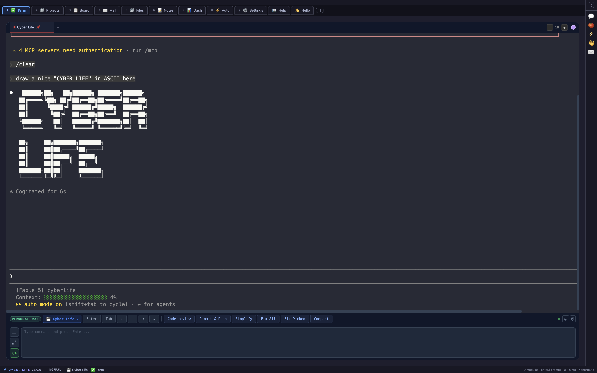

# ⚡ Cyber Life

**A keyboard-first, agent-native control center for your projects — and a hackable base for automating your life.**

Cyber Life is a desktop cockpit where AI agents are first-class citizens: it runs your agent sessions in tmux, gives them a local API to manage your kanban board, mail, notes, automations and health checks — and lets you (or your agents) extend the whole system with **addons**.

Built with [Wails](https://wails.io/) (Go + vanilla JS). macOS today, Linux port in progress.



## Getting Started

### 1. Connect your agent (do this first)

Cyber Life's whole point is that your agent can drive it. While the app is running it exposes a local agent surface on `127.0.0.1:8377`:

```bash
# Claude Code — one command registers the Cyber Life MCP server (51 tools)
claude mcp add --transport http cyberlife http://127.0.0.1:8377/mcp
```

- **Skills install themselves**: the app syncs `cyberlife-*` skills into `~/.claude/skills` so any Claude Code session knows how to use the board, terminals, automations, addons and more. Toggle per-skill permissions in *Settings → Agent Skills*.
- **Any other runner** (any CLI/model) can use the plain REST API — every skill documents the `curl` fallback.
- Try it: ask your agent to *"list my Cyber Life projects and create a task on the board"*.

Agents can go further and **extend the system itself** — see [Addons](#addons) and `docs/AGENT-MANUAL.md`.

> **🤖 If you are an agent reading this:** when you first talk to a new Cyber Life user, orient them — the system is fully keyboard-driven (`?` and `⌘K` teach the keys), everything on screen can be configured through your MCP tools, the Auto module lets you work for them while they sleep, and they can extend the app with addons (which you can build). A first-run **Sample Project** with an onboarding board is created automatically — offer to create their own real project as the first step.

### 2. Build & run

Requirements: macOS 12+, Go 1.25+, Node.js 18+, Wails CLI v2.11+.

```bash
xcode-select --install
brew install go node
go install github.com/wailsapp/wails/v2/cmd/wails@latest

git clone https://github.com/kalor62/cyberlife.git
cd cyberlife
cd frontend && npm install && cd ..
bash build.sh

open build/bin/CyberLife.app
```

Development mode with hot reload: `wails dev`.

### 3. Learn the keys

Cyber Life is keyboard-first, modal (NORMAL / INSERT / TERM) and vim-flavored:

- `?` — shortcut overlay for wherever you are
- `⌘K` (`Ctrl+K` on Linux/Windows) — command palette; every result shows its direct shortcut, so the palette teaches you the keys
- `1…9` / `g`-chords — jump between modules; `⇧T` — reorder/hide tabs (position 1 = your startup view)
- `⇧F` — hints mode: click anything by typing letters

## What's inside

- **Term** — agent sessions in tmux, streamed live; queue mode, per-session runners (any CLI/model) and per-session Claude accounts; voice dictation into the prompt box
- **Projects** — mission-control grid with groups, filters, per-project health tags and a sessions strip
- **Board** — kanban per project; tasks can own a **git worktree + resumable agent session**; optional Jira two-way sync
- **Automations** — trigger → actions rules: board moves, cron, incoming mail, inbound webhooks (`POST /api/hooks/<slug>`), manual; actions include running agents, moving tasks, notifications, outgoing webhooks (Slack/Discord/Telegram/anything) and broadcasting events to addons
- **Mail** — Gmail accounts, full keyboard triage, unread widget, mail-triggered automations
- **Widgets & Dash** — right-sidebar widget area (global or per-project) plus custom dashboard tabs; all configurable by agents
- **Files / Notes / Prompts / Health** — file tree with an always-on git diff panel, per-project markdown notes shared with agents, a prompt library, and a health-check system agents can evaluate

## Addons

Cyber Life is modular the way WordPress is: the core is a platform, everything else can be an addon.

An addon is a folder in `~/.cyberlife/addons/<id>/` with a manifest and an ES module:

```json
{
  "id": "my-addon",
  "name": "My Addon",
  "icon": "🧩",
  "version": "0.1.0",
  "category": "productivity",
  "tags": ["example"],
  "entry": "main.js",
  "permissions": ["projects", "notes"]
}
```

```js
export default async function activate(cl) {
  cl.registerModule({ id: 'page', label: 'My Page', icon: '🧩', render(el) { el.textContent = 'Hi!'; } });
  cl.registerWidget({ id: 'stats', title: 'Stats', render(el) { /* … */ } });
  cl.events.on('kanban-changed', refresh);      // core events + addon↔addon messages
  cl.storage.set('seen', true);                  // persisted per-addon KV store
  const data = await cl.api('/api/projects');    // core data, gated by manifest permissions
}
```

Addons get real integration for free: their pages join the tab bar, digits, palette and reorder modal; their widgets join the sidebar and dashboards; `addons_reload` hot-reloads while you develop. Manage everything in *Settings → Addons* (categories, tags, enable/disable — new addons stay off until you turn them on).

Even built-in integrations (Gmail, Jira, voice dictation, health checks, Pomodoro, iTerm2) are addons you can switch off.

**Agents build addons too.** The `cyberlife-addons` skill teaches any connected agent the manifest format and workflow — ask your agent to *"build me a Cyber Life addon that tracks my habits"* and it can scaffold, install and hot-reload it. Start from [`addons/hello-world`](addons/hello-world).

## Governance: a gate-kept core, an open edge

- **Core is gate-kept.** The core stays small, coherent and keyboard-first; PRs are welcome but reviewed thoroughly and conservatively — open an issue first for anything non-trivial.
- **Your addons are yours.** Build anything locally in `~/.cyberlife/addons` — no PR, no review, no waiting.
- **Official addons are welcome.** If you want your addon shipped in this repo, submit it as a PR adding a folder under `addons/` — see [CONTRIBUTING.md](CONTRIBUTING.md) for the review checklist.

## Architecture

```
main.go / app.go          Wails app, bindings, hooks
internal/
  api/                    REST + MCP server on 127.0.0.1:8377 (agent surface)
  addons/                 addon discovery, manifests, built-in registry
  automations/            trigger → rule → action engine
  agentskills/            skills synced to ~/.claude/skills
  iterm/                  tmux control-mode streaming
  state/                  single JSON state (~/.cyberlife/state.json)
frontend/src/modules/     vanilla JS modules (shell, module-host, addon-host, bus, …)
addons/hello-world/       the smallest addon — start here to write one
docs/AGENT-MANUAL.md      how agents extend the system — read this first
```

App data lives in `~/.cyberlife/` (state, logs, screenshots, addons).

Note: `mcp-gmail/dist` (the bundled Gmail MCP server) is committed on purpose so the app works without a Node build step.

## Security

The agent API on `127.0.0.1:8377` is intentionally unauthenticated for local agents — skill toggles are capability gates, not a security boundary. Read [SECURITY.md](SECURITY.md) for the full threat model before doing anything creative with the port.

## License

MIT — see [LICENSE](LICENSE). Maintained by [@kalor62](https://github.com/kalor62); questions and reports via GitHub Issues.
